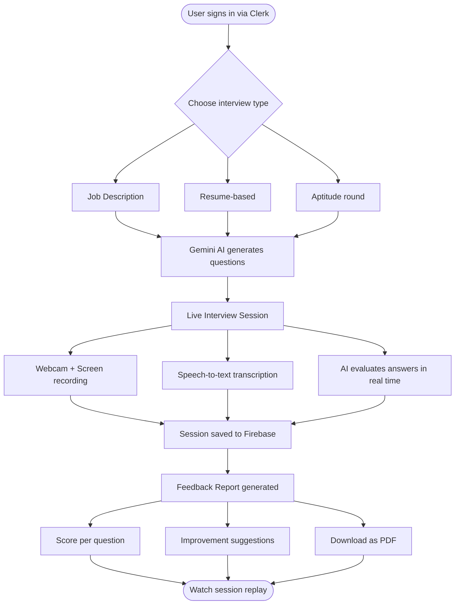

<div align="center">

<!-- Place banner.png in /public and commit it for this to render -->


<br/>


</div>

<br/>

A browser-based mock interview platform that uses Google Gemini AI to generate interview questions, evaluate your spoken answers in real time, and deliver a detailed performance report — all without needing a human interviewer.

---

## How it works



---

## Features

- Create interviews from a **job description** or your **resume**
- **Gemini AI** generates role-specific questions and scores your answers
- **Speech-to-text** captures verbal responses in real time
- **Webcam + screen recording** for full session replay
- Detailed **feedback report** with per-question scores and suggestions
- Export your feedback as a **PDF**
- **Admin dashboard** to monitor candidates and sessions
- Secure auth with **Clerk** — protected routes out of the box
- Dark / light mode

---

## Tech stack

| Layer | Technology |
|---|---|
| Frontend | React 18, TypeScript, Vite |
| Styling | Tailwind CSS, Radix UI, Framer Motion |
| AI | Google Gemini (`@google/generative-ai`) |
| Auth | Clerk |
| Database | Firebase Firestore |
| Hosting | Firebase Hosting / Docker |
| Forms | React Hook Form + Zod |
| Code Editor | Monaco Editor |
| PDF Export | jsPDF |

---

## Project structure

```
src/
├── api/                    # API layer
├── components/             # All UI components
│   ├── ui/                 # Base design system (buttons, modals, etc.)
│   ├── question-section-ollama.tsx
│   ├── enhanced-feedback-report.tsx
│   ├── container-recorder.tsx
│   ├── screen-interview-recorder.tsx
│   └── ...
├── routes/                 # Page-level components
│   ├── home.tsx
│   ├── dashboard.tsx
│   ├── mock-interview-page-ollama.tsx
│   ├── feedback.tsx
│   └── ...
├── layouts/                # Public, Auth, Protected layout wrappers
├── hooks/                  # Custom React hooks
├── services/               # Firebase service logic
├── types/                  # TypeScript types
└── config/                 # App-level configuration
```

---

## Getting started

### Prerequisites

- Node.js 18+
- pnpm (recommended) or npm
- A [Firebase](https://firebase.google.com) project
- A [Clerk](https://clerk.com) application
- A [Google Gemini](https://aistudio.google.com) API key

### Setup

```bash
# 1. Clone
git clone https://github.com/your-username/aimock.git
cd aimock

# 2. Install dependencies
pnpm install

# 3. Add environment variables
cp .env.example .env.local
```

Fill in your `.env.local`:

```env
VITE_CLERK_PUBLISHABLE_KEY=pk_...

VITE_GEMINI_API_KEY=...

VITE_FIREBASE_API_KEY=...
VITE_FIREBASE_AUTH_DOMAIN=...
VITE_FIREBASE_PROJECT_ID=...
VITE_FIREBASE_STORAGE_BUCKET=...
VITE_FIREBASE_MESSAGING_SENDER_ID=...
VITE_FIREBASE_APP_ID=...
```

```bash
# 4. Start dev server
pnpm dev
```

Open `http://localhost:5173`

---

## Deployment

### Firebase Hosting

```bash
pnpm build
firebase deploy
```

### Docker

```bash
docker build -t aimock .
docker run -p 80:80 aimock
```

---

## Routes

| Path | Access | Page |
|---|---|---|
| `/` | Public | Landing page |
| `/about` | Public | About |
| `/signin` | Public | Sign in |
| `/signup` | Public | Sign up |
| `/admin-signin` | Public | Admin login |
| `/admin-dashboard` | Admin | Admin panel |
| `/generate` | Protected | Interview dashboard |
| `/generate/:id` | Protected | Edit interview |
| `/generate/interview/:id/start` | Protected | Live interview |
| `/generate/feedback/:id` | Protected | Feedback report |
| `/generate/watch-session/:id` | Protected | Session replay |
| `/generate/create/job-description` | Protected | Create from JD |
| `/generate/create/resume-based` | Protected | Create from resume |

---

## Contributing

1. Fork the repo
2. Create a branch: `git checkout -b feature/your-feature`
3. Commit: `git commit -m "add your feature"`
4. Push and open a pull request

---

<div align="center">
Built with React, TypeScript, and Google Gemini AI
</div>
